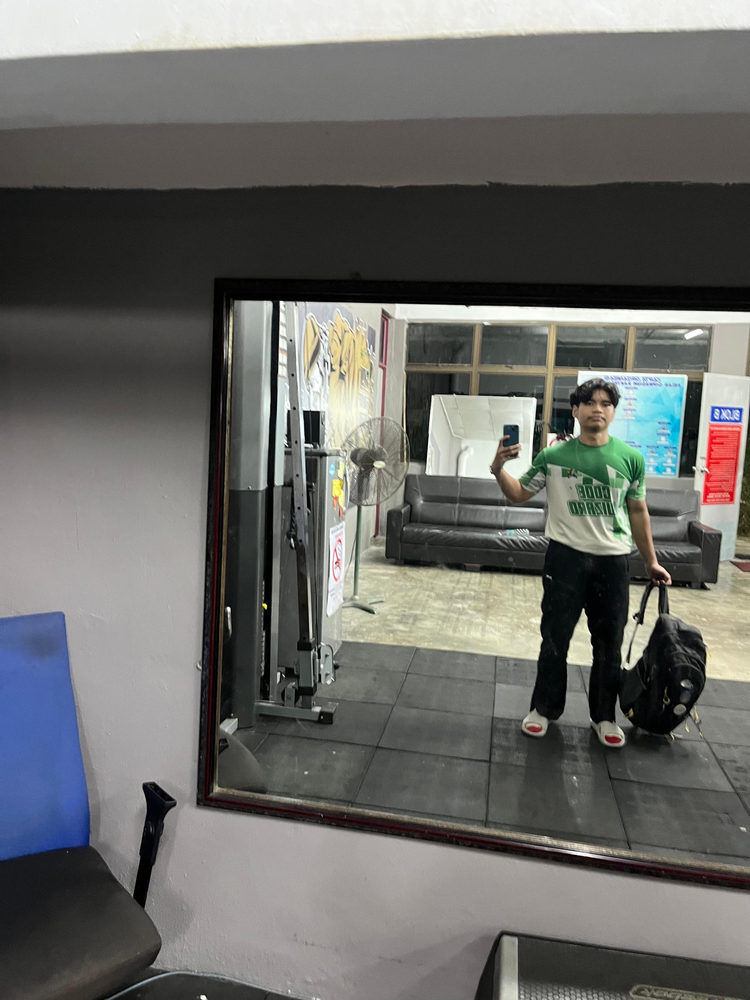

# Introduction
I expect to learn a lot about modern software maintenance
practices and how to work with legacy systems.  

- **Fun fact**: I enjoy building web applications using Laravel and Vue.js in my free time.  
- **Course expectations**: To gain hands-on experience in
maintaining and evolving software while improving my understanding of real-world system updates and debugging processes.

  <!-- Link to the uploaded image -->
 

## GitHub Profile
You can view my personalized GitHub profile https://github.com/Vambot07

